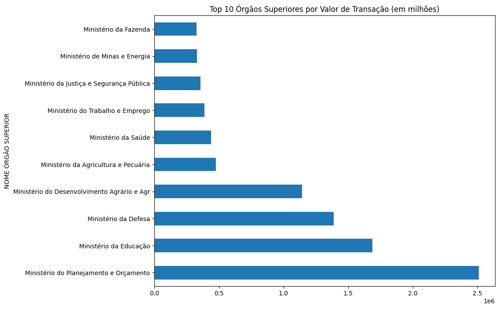
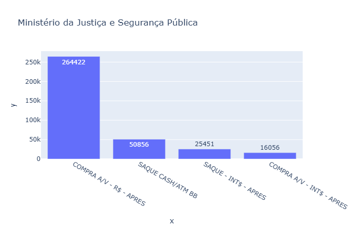

# Análise de Gastos: Cartões Corporativos do Governo Federal (Janeiro/2026)

### Este projeto apresenta uma Análise Exploratória de Dados (EDA) com foco no uso de recursos públicos por meio do Cartão de Pagamento do Governo Federal (CPGF). O estudo aplica técnicas de tratamento de dados para transformar dados brutos governamentais em insights estratégicos.

---

## 🎯 Objetivo do Projeto

### O objetivo central desta análise é auditar e entender o comportamento de consumo estatal durante o mês de janeiro de 2026, respondendo a duas perguntas fundamentais:

* Quais órgãos governamentais apresentam os maiores volumes de gastos?
* Existe um padrão identificável nos gastos por tipo de despesa em cada órgão?

---

## 📖 Entendendo os Tipos de Despesa

### Os dados da CGU utilizam siglas específicas para categorizar como o dinheiro público foi utilizado. Abaixo está um resumo das principais transações analisadas:

* **COMPRA A/V - R$ - APRES:** Compras à vista pagas em Real (nacional) utilizando o cartão fisicamente no estabelecimento.
* **SAQUE CASH/ATM BB:** Saques de dinheiro vivo realizados em caixas eletrônicos do Banco do Brasil para despesas que não aceitam cartão.
* **COMPRA A/V - INT$ - APRES:** Compras à vista pagas em moeda estrangeira (internacional) com a apresentação do cartão.
* **SAQUE - INT$ - APRES:** Saques de dinheiro vivo realizados no exterior.

---

## 📊 Principais Resultados e Visualizações

### A investigação estruturou o comportamento de consumo governamental e gerou os seguintes entregáveis:

#### **Ranking Top 10:** Identificação e consolidação dos dez órgãos superiores que mais realizaram despesas utilizando o cartão corporativo.

#### **Padrões de Consumo:** Mapeamento do perfil de uso dos órgãos superiores, cruzando o volume financeiro com o tipo de despesa realizada. (Ex. Ministério da Justiça e Segurança Pública)

---

## 🛠️ Metodologia e Fonte de Dados

* **Fonte dos Dados:** Portal da Transparência da Controladoria-Geral da União (CGU).
* **Processamento de Dados:** Tratamento de dados para limpeza de valores nulos e agregação das bases originais.
* **Análise Exploratória:** Geração de estatísticas descritivas para identificar tendências de gastos públicos e distribuição de verbas.

---

## 🚀 Como Executar o Projeto

> **Nota:** Certifique-se de ter as bibliotecas de análise de dados (como Pandas e Plotly) instaladas em seu ambiente antes de rodar os scripts.

1. Clone este repositório em sua máquina local.
2. O arquivo de dados original (`dataframe.csv`) já está incluso no repositório para facilitar a execução.

3. Abra e execute o notebook `analise.ipynb` para reproduzir a limpeza, o tratamento de dados e a geração dos insights.

